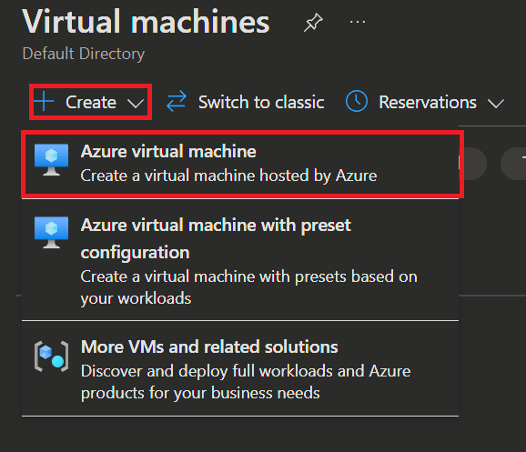
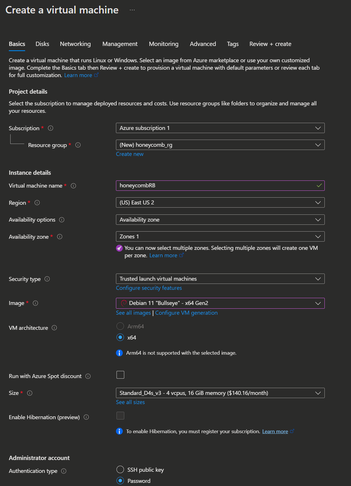
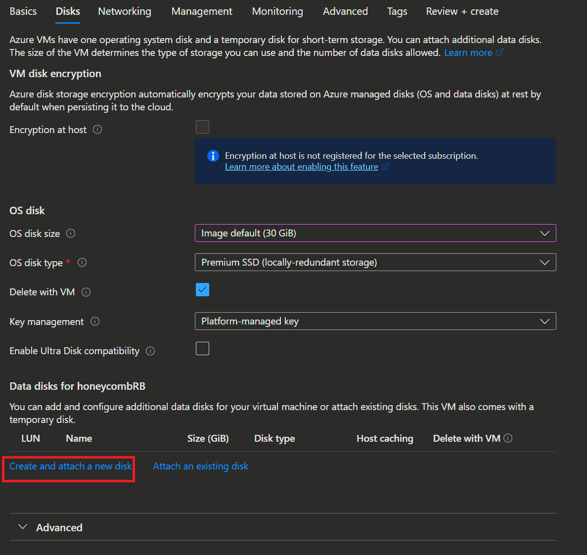
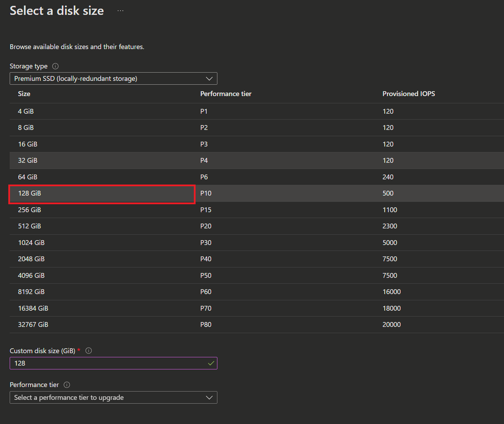
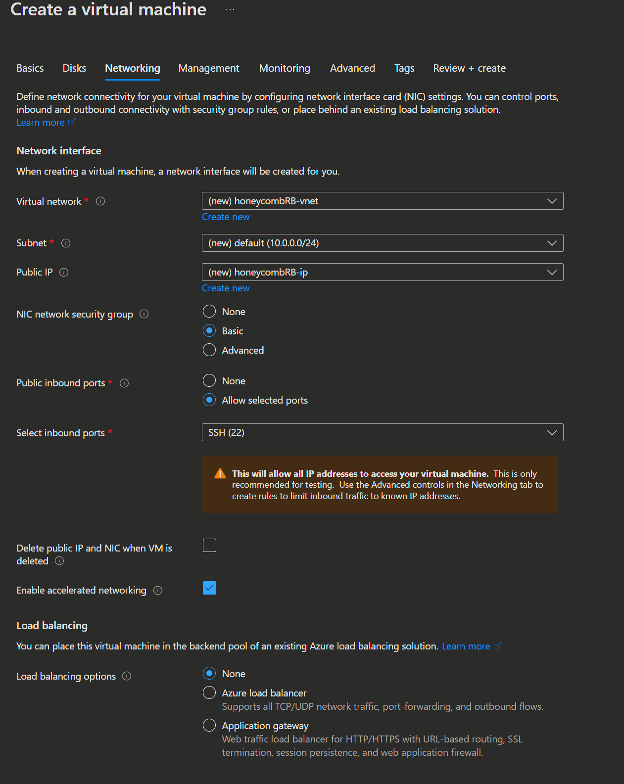
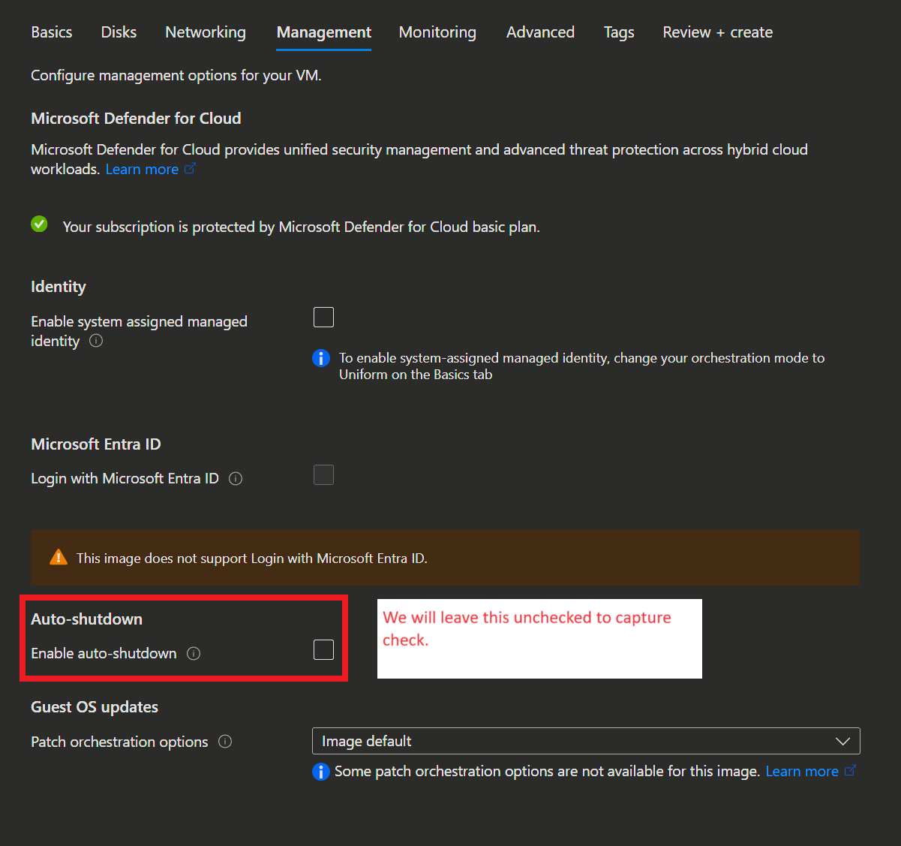
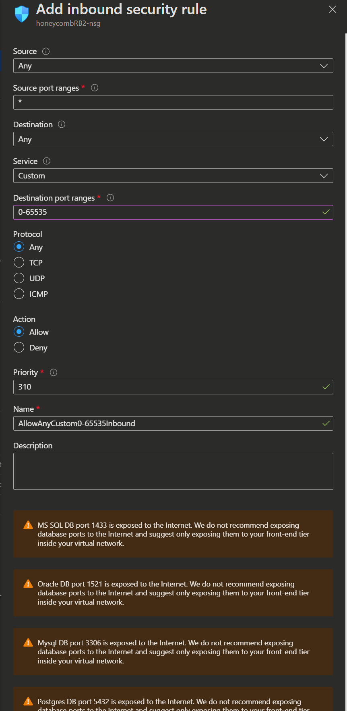
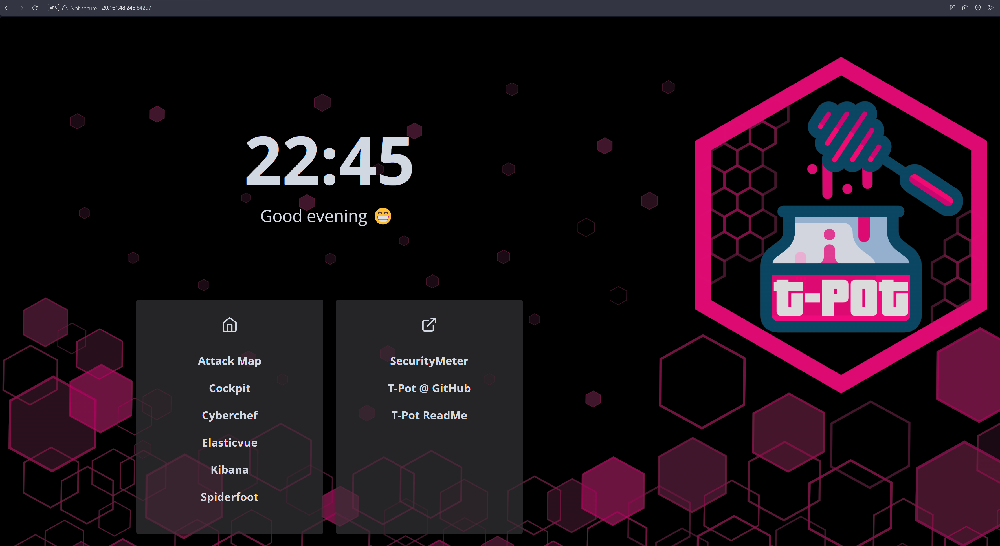

# Azure Honeypot
## Overview

Deployment of T-Pot Honeypot in Azure

## Tools Used

- **Azure**: Spun up debian 11 virtual machine to host the honeypot.
- **VirtualBox**: Kali Linux virtual machine to SSH into the host.
- **T-Pot platform**: all in one honeypot platform

## Deployment Steps

### Virtual Machine
- AMI: Debian 11
- Size: Standard D4s v3 (4 vcpus, 16 GiB)
- Storage: 128 GB

### Azure Setup

## Kibana Dashboard 

## Documented Findings

IP with the most attack counts: 122.226.191.252
- Attack Count: 922
- Location: Hangzhou China
- Ran spiderfoot scan and ip address considered malicious
- 

Most attacks by country: United States
42276 total attacks in 24 hours

